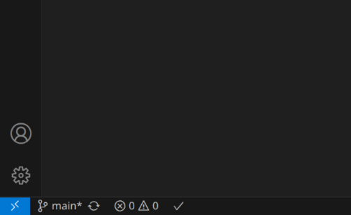
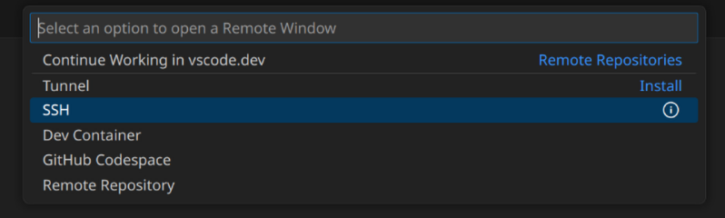
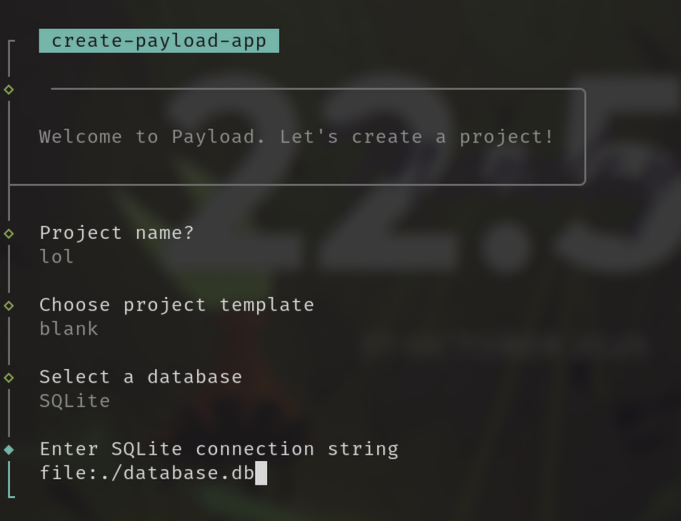
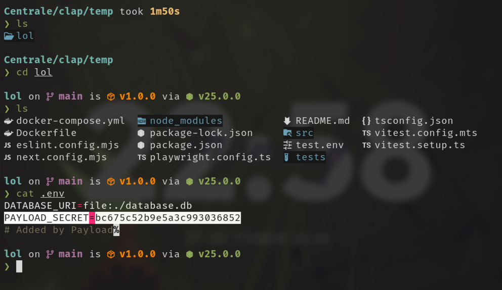

# Site d'emprunt de matos du CLAP

# Guide de démarrage

Ce guide a pour but de vous aider à mettre en place un environnement de développement web complet avec tous les outils nécessaires. Il n'y a pas de prérequis, tout ce dont vous avez besoin est un pc, un peu de patience et une tasse de thé (optionnel).

### &rarr; C'est parti !


## 0. Pré-requis
#### (Vous pouvez sauter cette partie si vous êtes déjà familier avec les systèmes Linux et que votre machine en possède déjà un)

Avant toute chose, le plus important est de disposer d'une distribution Linux sur votre machine. Si vous disposez d'un pc sous Windows (paix à votre âme) deux options s'offrent à vous :

- Installer **WSL** (_Windows Subsystem for Linux_)
- Installer Linux **directement sur votre machine**

Quelque soit l'option que vous choisirez, il sera possible de contribuer au développement du site, mais gardez à l'esprit qu'une vraie distribution linux occupera un espace conséquent sur votre machine (il faudra partitionner votre disque windows pour réduire sa taille) mais dispose en contrepartie d'une interface graphique (toute interaction avec WSL devra se faire en **ligne de commande**)

Si vous disposez d'un mac (paix à votre portefeuille) alors il n'est pas nécessaire d'installer Linux, l'environnement mac est déjà adapté au développement.

---

> (Dans la suite, on supposera que la distribution choisie est **Ubuntu.** Il en existe plein d'autres, mais celle-ci est la plus simple à appréhender pour des débutants. Si vous utilisez déjà une autre distro, c'est probablement que ce tuto ne vous servira à rien de toute façon :) )

---

### 0.1 Installer WSL

Pour installer WSL sur sa machine, suivre [ce tutoriel](https://www.youtube.com/watch?v=zZf4YH4WiZo) de Devtamin. Cela devrait vous prendre une dizaine de minutes.

### 0.2 Installer Linux sur sa machine

Pour installer Ubuntu sur sa machine, le plus simple est de suivre [cet excellent tutoriel](https://www.youtube.com/watch?v=qq-7X8zLP7g) de SavvyNik. C'est avec lui que j'ai appris à installer Linux pour la première fois (la belle époque...)

> Avant de vous lancer dans l'installation, assurez-vous d'avoir votre pc branché sur secteur (sauf si vous aimez vivre dangereusement) et même si l'installation est sans danger dans 99% des cas, soyez quand même un minimum concentrés, ce n'est pas une manip à faire par-dessus la jambe.

**Autre conseil** : il est préférable d'installer Linux en **anglais** (je parle de la langue du système, pas la langue du clavier) ; il sera en effet plus simple de _googler_ les messages d'erreurs si ceux-ci sont déjà en anglais. (Croyez-moi, vous allez en voir **beaucoup**)

&rarr; Une fois votre distribution linux installée sur votre bécane, vous pouvez soit passer un peu de temps à [apprendre à utiliser Linux](https://labex.io/linuxjourney) (J'ai trouvé ce site grâce à [cette excellente vidéo](https://www.youtube.com/watch?v=zIdv2NDRExI) qui résume la mentalité des utilisateurs linux), soit passer directement à la suite du guide si vous avez la flemme. (M'enfin c'est quand même plus sympa si vous comprenez ce que vous faites)

## 1. Dépendances

Pour ce projet, vous allez avoir besoin de : 

- `git` (normalement déjà installé)
- `curl` (idem)
- Un éditeur de code (`VSCode` ou `WebStorm` par exemple)
- `Node.js` et `npm`
- `Java`
- `FakeSMTP`

--- 

### - `git` et `curl` :

`git` est un utilitaire qui permettra de suivre l'historique des versions du projet en gardant la trace des modifications successives, aussi appelées _diffs_. (J'aimerais m'épancher sur le sujet, mais je laisse le soin à mes amis du Rezoleo de vous tunnel pendant la forma git de 4h). `git` permet également d'avoir accès à toutes les commandes relatives à **GitHub**, l'hébergeur de code en ligne utilisé pour ce projet. (ce que je dis devrait avoir du sens dans quelques lignes)

`curl` est un outil permettant de télécharger rapidement des fichiers sur le web. À moins que votre distribution linux soit **très** obscure, il devrait être installé par défaut, tout comme `git`. Vous en aurez besoin dans la suite.

### - `VSCode` / `WebStorm`

Un bon éditeur de code, c'est un éditeur qu'on sait utiliser. Si vous venez déjà de [VSCode](https://code.visualstudio.com/) ou de [WebStorm](https://www.jetbrains.com/fr-fr/webstorm/), il n'y a pas de raison de changer. (même si je recommande WebStorm pour ce projet, VSCode n'étant à privilégier que si votre machine est assez lente)

Pour installer `VSCode` sur Ubuntu, c'est simple : 

`snap install code --classic`  

(même si personnellement je **déteste** les snaps ; quitte à choisir, je préfère utiliser [la méthode PPA](https://doc.ubuntu-fr.org/visual_studio_code#via_le_ppa_de_microsoft_deconseille))

Pour `WebStorm` : 

`sudo snap install webstorm --classic`

(encore une fois, pas fou, si vous êtes determinés, vous pouvez utiliser [cette méthode](https://www.jetbrains.com/help/webstorm/installation-guide.html#install-toolbox-linux))

#### Petit conseil : 
Pour les gens qui ont installé WSL, il est possible d'installer VSCode sur **Windows** (pas dans WSL) et d'appuyer sur le petit bouton bleu en bas à **gauche** :



Normalement, vous devriez voir apparaitre un menu en haut, avec une option "se connecter à WSL" (elle n'apparaît pas sur mon screen... car je suis sous Linux :) )



Cela devrait vous permettre d'utiliser VSCode dans Windows tout en vous connectant à votre session WSL (Quand vous ouvrirez un terminal dans VSCode, ce sera le terminal de votre machine virtuelle linux !)

### - `Node.js` et `npm`

Pour installer `Node.js` et `npm`, le plus simple (et le plus pratique pour la suite) et d'installer `nvm` avec cette commande : 

`curl -o- https://raw.githubusercontent.com/nvm-sh/nvm/v0.40.3/install.sh | bash`

Relancez votre terminal une fois le script d'installation terminé, et lancez `nvm install node`. Cette commande devrait installer les dernières versions de Node.js et npm.

Vous pouvez confirmer que l'installation s'est bien déroulée en tapant `node -v` et `npm -v` : vous devriez voir les numéros de version de chacun des paquets s'afficher.

### - `Java`

Installer Java sur Ubuntu est on ne peut plus simple : 

`sudo apt install default-jre`

Similairement, on peut vérifier que tout est bon en affichant le numéro de version avec : `java -version`

### - `FakeSMTP`

On en a bientôt fini avec les dépendances !  
L'installation de FakeSMTP doit se faire dans le même dossier que celui où sera copié le repo github (`projet_clap/` par exemple).  
Dans ce dossier, il va falloir créer un sous-dossier que l'on va appeler `fake_smtp` et dans lequel on va devoir télécharger [ce fichier](https://github.com/gessnerfl/fake-smtp-server/releases/download/2.5.0/fake-smtp-server-2.5.0.jar).  

Dans ce même sous-dossier, on va créer un fichier nommé `application.yaml` qui devra contenir ces lignes :

```yaml
fakesmtp:
  #The SMTP Server Port used by the Fake SMTP Server
  port: 8025

  #The binding address of the Fake SMTP Server; Bound to all interfaces by default / no value
  bindAddress: 127.0.0.1

  #List of recipient addresses which should be blocked/rejected
  blockedRecipientAddresses:
    - blocked@example.com
    - foo@eample.com

  #List of sender email addresses to ignore, as a comma-separated list of regex expressions.
  filteredEmailRegexList: john@doe\\.com,.*@google\\.com ; empty by default

  #Optional configuration option to specify the maximum allowed message size. The size can be 
  #defined using Spring Boot DataSize value type - https://docs.spring.io/spring-boot/docs/2.1.9.RELEASE/reference/html/boot-features-external-config.html#boot-features-external-config-conversion-datasize.
  #Default: no limit
  maxMessageSize: 10MB

  #Configure if TLS is required to connect to the SMTP server. Defaults to false. See TLS section below
  requireTLS: false

  #When set to true emails will be forwarded to a configured target email system. Therefore
  #the spring boot mail system needs to be configured. See also 
  # https://docs.spring.io/spring-boot/docs/current/reference/html/spring-boot-features.html#boot-features-email
  forwardEmails: false
```

On en a fini avec les dépendances pour l'instant !

## 2. Préparation du projet

Après s'être placé dans notre répertoire `projet_clap/`, on va venir cloner le repo GitHub du projet avec la commande : 

`git clone https://github.com/Intellix7/clap_matos.git`

Une fois la commande finie, on va se déplacer dans le répertoire `clap_matos/` et on va taper : 

`cp .env.example .env`

Ouvrir le fichier `.env` dans un éditeur de texte. Il devrait ressembler à ça : 

```.dotenv
DATABASE_URI=mongodb://127.0.0.1/your-database-name # mongo / postgres / sqlite
PAYLOAD_SECRET=YOUR_SECRET_HERE
SMTP_HOST=mail.example.com
SMTP_PORT=your-smtp-port
```

Remplacer ces lignes par : 

```dotenv
DATABASE_URI=file:./database.db
PAYLOAD_SECRET=
SMTP_HOST=127.0.0.1
SMTP_PORT=8025
```

Pour remplir la ligne `PAYLOAD_SECRET`, il va falloir effectuer une petite manip : En revenant dans le répertoire `projet_clap/`, créer un dossier `temp/` et aller dedans. Ensuite, entrer `npx create-payload-app`, choisir la template `blank`, une base de données `SQLite` et le _connection string_ : `file:./database.db`



Le module `payload` devrait créer un début de projet, mais ce qui nous intéresse va se trouver dans le fichier `.env` du dossier de l'application : 



Vous devrez récupérer la ligne `PAYLOAD_SECRET` (ne recopiez pas ma valeur ; prenez la vôtre !) et l'entrer dans le fichier `.env` du répertoire `projet_clap/clap_matos/`.

> Le `PAYLOAD_SECRET` est personnel et doit rester **secret** (c'est dans le nom...), cela signifie que vous ne devez **surtout pas le publier sur GitHub** ! Gardez-le pour vous, bien au chaud sur votre machine.

---

Pour finir, on revient dans le répertoire `clap_matos/` et on tape : 

`npm install`

Afin d'installer toutes les dépendances node nécessaires à la construction du projet.

Cela devrait prendre un peu de temps, mais rassurez-vous, l'étape de préparation est terminée !


## 3. Lancement du serveur dev

Pour lancer le serveur de dev et enfin pouvoir accéder au site depuis sa machine, il faut : 

- Lancer le serveur FakeSMTP
- Lancer le serveur dev

La première étape s'effectue en allant dans le répertoire `fake_smtp/` et en tapant ` java -jar fake-smtp-server-2.5.0.jar`

> Le lancement du serveur devrait occuper votre console ; n'hésitez donc pas à ouvrir un autre terminal pour la suite

Pour lancer le serveur dev, il suffit de revenir dans le répertoire `clap_matos/` et de taper `npm run dev`.

Dans la console, vous devriez voir des informations concernant le statut du site, et plus particulièrement l'adresse à laquelle on peut y accéder : http://localhost:3000  

Cliquez dessus et le site devrait s'ouvrir dans votre navigateur ! 


## Troubleshooting 

Si vous rencontrez des problèmes lors de l'installation, n'hésitez pas à me le faire remonter, j'ai probablement oublié des trucs en chemin...
